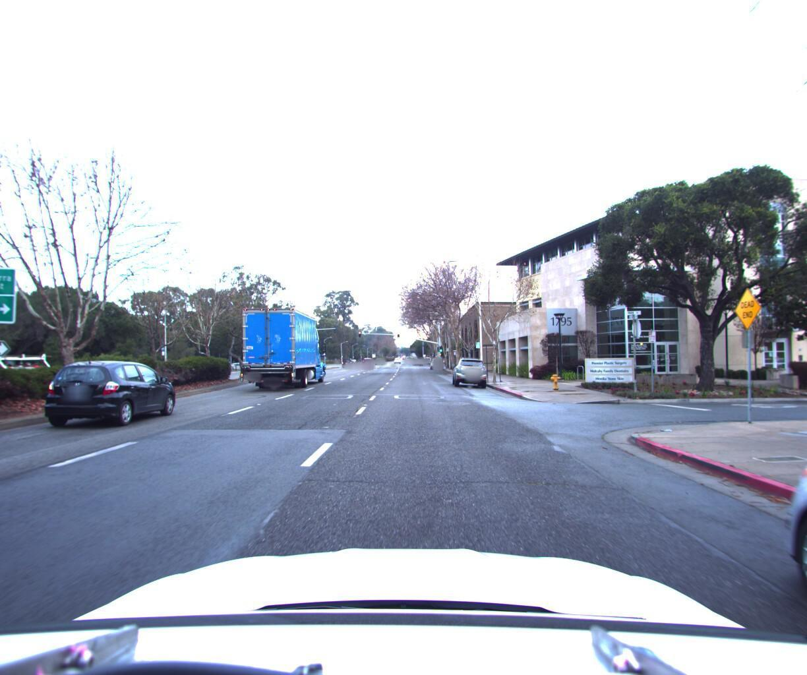
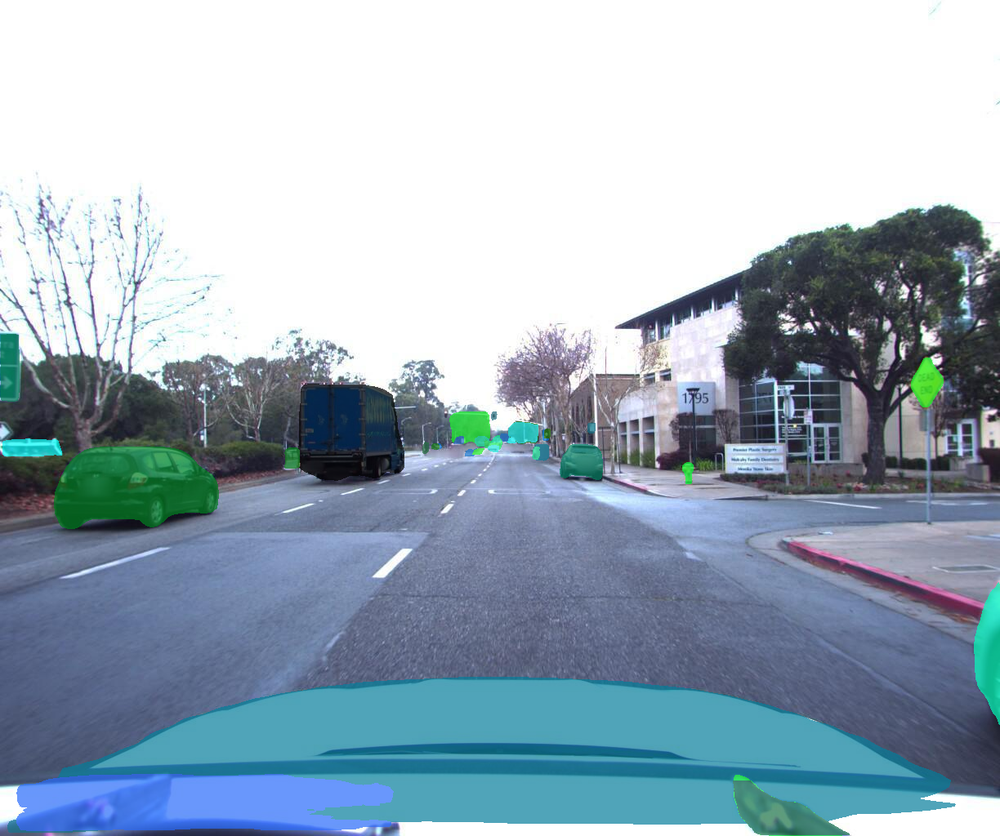

# Urban Autonomy Instance Segmentation

## Introduction

 


***Urban Autonomy Instance Segmentation*** is a project focused on comparing deep learning instance segmentation models in an urban environments autonomous driving technology setups. Utilizing the COCO dataset, this project applies instance segmentation methods to identify and segment various objects encountered in urban driving scenarios, such as vehicles, pedestrians, and street signs.

## Dataset

We used pruned version of COCO dataset, which contains only images relevant to urban driving scenarios.
Classes present in the dataset are:
- person
- bicycle
- car
- motorcycle
- bus
- truck
- traffic light
- fire hydrant
- stop sign
- parking meter
- cat
- dog

We provide script to download dataset in `setup_enviroment.sh` file.


## Usage

### Clone the repository

```
git clone --recurse-submodules https://github.com/JanekDev/urban-autonomy-instance-segmentation.git
```

### Requirements
    
Create a virtual environment and install the required packages:

```
pip install -r requirements.txt
```

Or if you want to completely setup the repository (large GPU nodes for rent), including the datasets, run:

```
bash setup_enviroment.sh
```

## Training

### Mask R-CNN
```bash
python3 main.py --config-name config.yaml
```

### Other models

See the repository of the model you want to train for instructions (submodules) and run the training accordingly.
